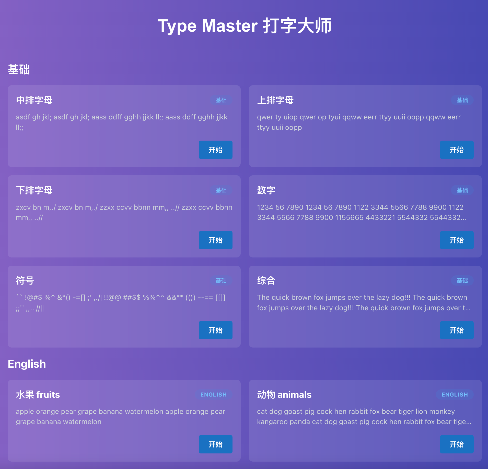
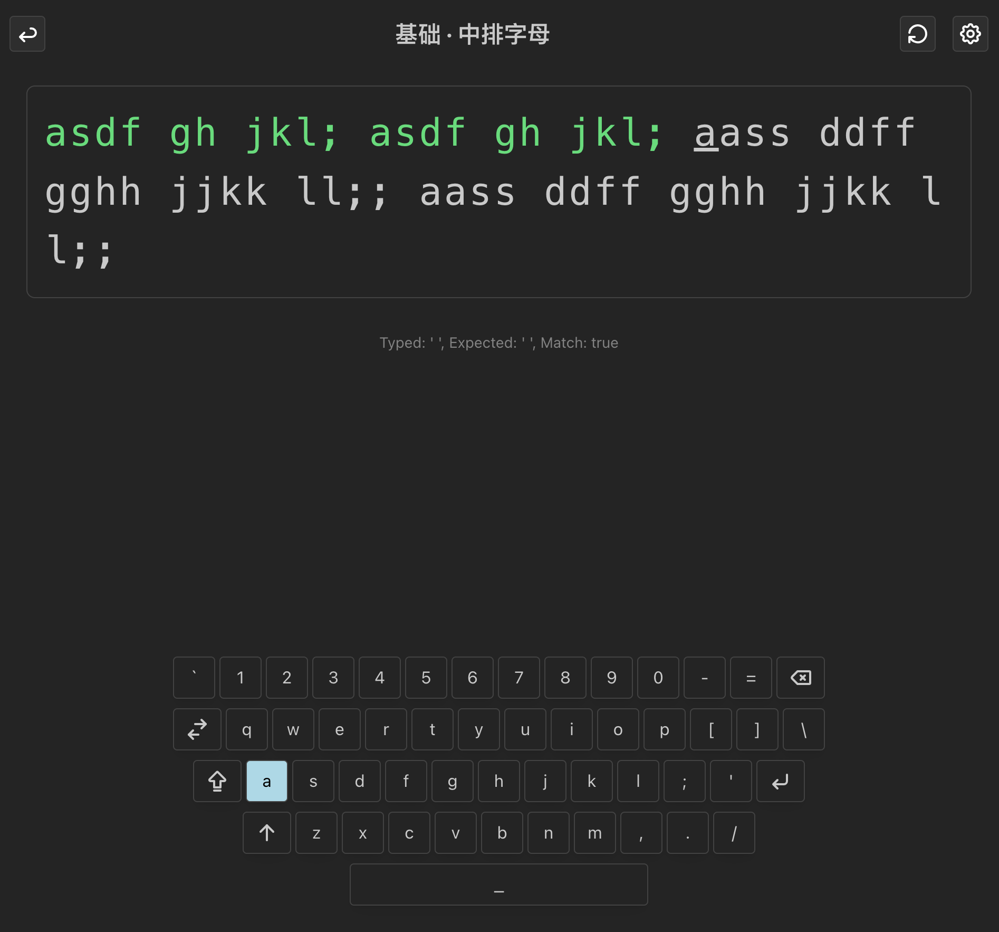
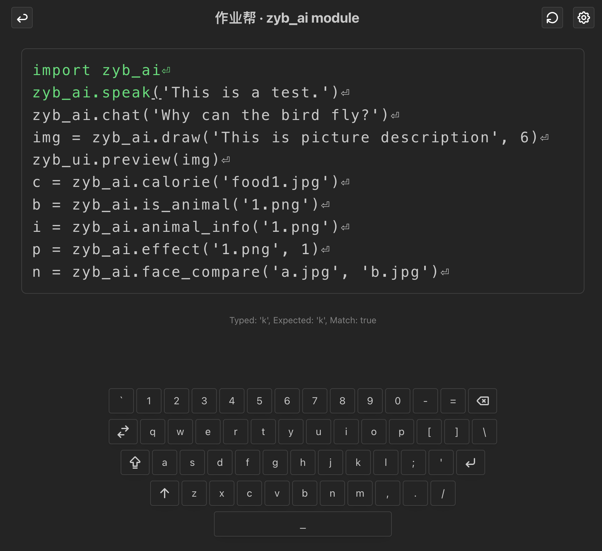

# TypeMaster

这是个打字练习软件，包括基础打字练习、英语单词、Python编程等。用的技术栈为：React + TypeScript + Vite + Mantine + eslint。






## Task

- [x] 基础打字练习
- [x] 英语单词
- [x] Python编程
- [x] 作业帮
- [x] 显示键盘
- [ ] 显示手势
- [ ] 自定义打字关卡
- [ ] 游戏模式（机甲打落石）


## Install

```bash
npm install
```

## Run

```bash
npm run dev
```

## Build

```bash
npm run build
```